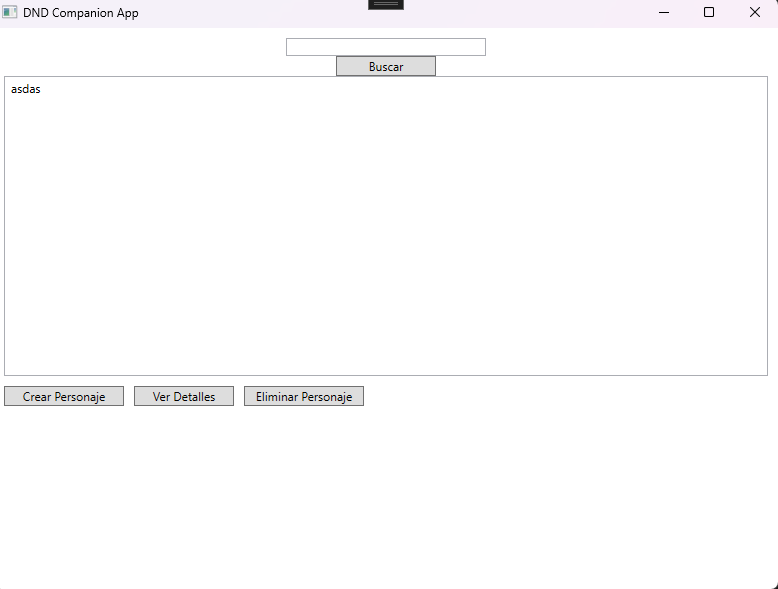
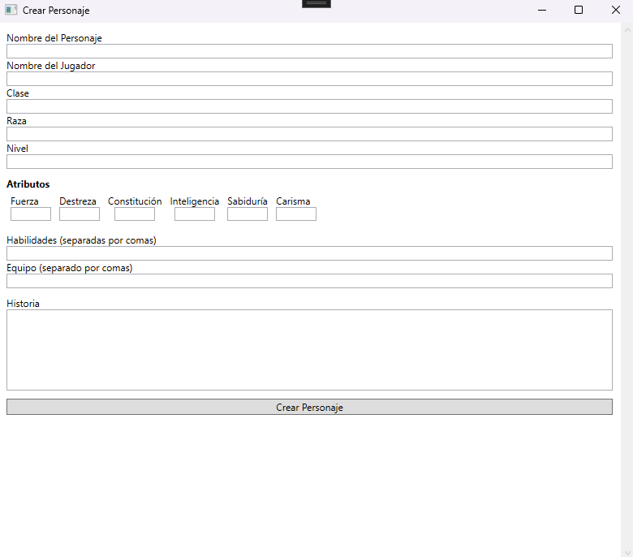
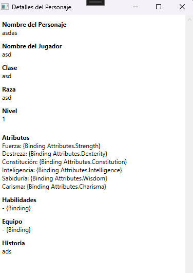

# D&D Companion App

A desktop application built with C# and WPF to help manage character sheets for Dungeons & Dragons 5th Edition. This app allows players and dungeon masters to create, view, and manage characters using a local MongoDB database.

## Table of Contents

- [Features](#features)
- [Screenshots](#screenshots)
- [Prerequisites](#prerequisites)
- [Installation](#installation)
- [Usage](#usage)
- [Project Structure](#project-structure)
- [Contributing](#contributing)
- [License](#license)
- [Contact](#contact)

## Features

- **Create Character Sheets**: Input character details, attributes, skills, equipment, and backstory.
- **View Character Details**: Display comprehensive information about each character.
- **Search Functionality**: Quickly find characters by name, class, or race.
- **Delete Characters**: Remove characters from the database.
- **Local Database Storage**: Uses MongoDB for data persistence.

## Screenshots



*Main window displaying the list of characters.*



*Window for creating a new character.*



*Detailed view of a character's information.*

## Prerequisites

- **Windows OS**: This application is built for Windows platforms.
- **.NET 6.0 SDK**: [Download here](https://dotnet.microsoft.com/en-us/download/dotnet/8.0)
- **Visual Studio 2022**: Community Edition or higher.
- **MongoDB Community Server**: [Download here](https://www.mongodb.com/try/download/community)
- **MongoDB Compass** (Optional): For database visualization. [Download here](https://www.mongodb.com/try/download/compass)
## Usage

1. Run the Application
	- Press F5 in Visual Studio or run the executable from the bin folder.

2. Create a New Character
	- Click on "Create Character".
	- Fill in the character details and click "Create Character".
3. View Character Details
	- Select a character from the list.
	- Click on "View Details" to see all information about the character.

4. Search for Characters
	- Use the search bar to filter characters by name, class, or race.

5. Delete a Character
	- Select a character from the list.
	- Click on "Delete Character" and confirm the deletion.

## Project Structure

DNDCompanionApp/
├── DataAccess/
│   └── DatabaseConnection.cs
├── Models/
│   ├── Attributes.cs
│   └── CharacterSheet.cs
├── ViewModels/
│   └── CharacterViewModel.cs
├── Views/
│   ├── CreateCharacterWindow.xaml
│   ├── CreateCharacterWindow.xaml.cs
│   ├── CharacterDetailsWindow.xaml
│   └── CharacterDetailsWindow.xaml.cs
├── MainWindow.xaml
├── MainWindow.xaml.cs
├── App.xaml
├── App.xaml.cs
└── README.md

- DataAccess: Contains classes responsible for database connections and operations.
- Models: Defines the data structures used in the application.
- ViewModels: Implements the MVVM pattern for data binding between views and models.
- Views: Contains all the XAML UI files and their code-behind.

## Installation

1. **Clone the Repository**

   ```bash
   git clone https://github.com/yourusername/dnd-companion-app.git
   cd dnd-companion-app

2. **Install MongoDB**

- Download and install MongoDB Community Server.
- Ensure MongoDB is running on localhost:27017.

3.	**Configure the Database Connection**
- Open DatabaseConnection.cs.
- Verify the connection string:

	```bash
   var client = new MongoClient("mongodb://localhost:27017");
	_database = client.GetDatabase("DNDCharacters");

## Contributing

Contributions are welcome! Please follow these steps:

1. Fork the Repository

2. Create a Feature Branch
	```bash
	git checkout -b feature/YourFeature

3. Commit Your Changes
	```bash
	git commit -m "Add YourFeature"

4. Push to Your Fork
	```bash
	git push origin feature/YourFeature

5. Open a Pull Request

## License
This project is licensed under the MIT License.

## Contact
Author: Diego LAurora
GitHub: dlaurora
Feel free to reach out for any questions or suggestions!

